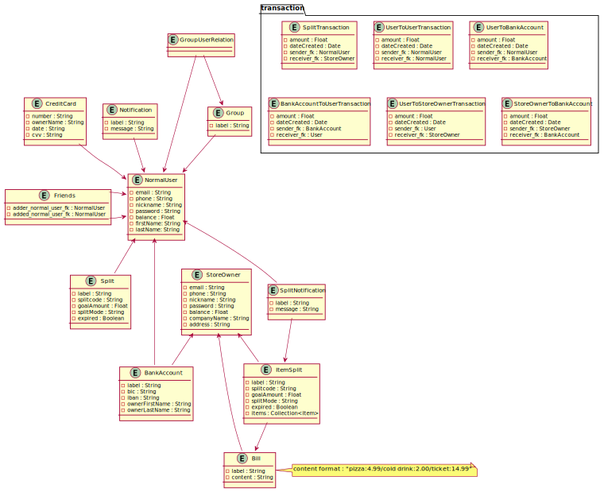

# MYSQL Database diagram

### Class diagram

This is the first version of the database schema.

We decided not to represent the links with transactions because it would have made 
the diagram unreadable.
We therefore represent the links with private attributes in the entities.

