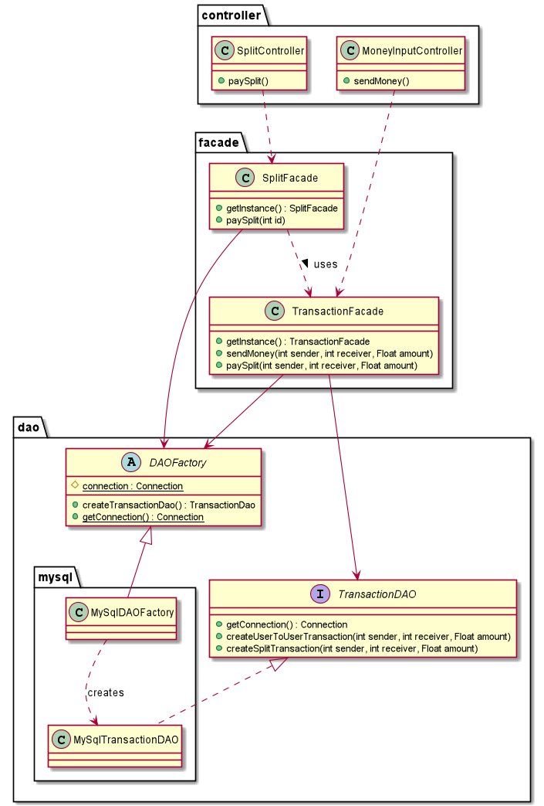
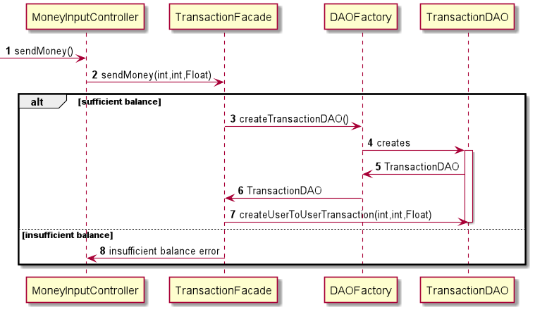
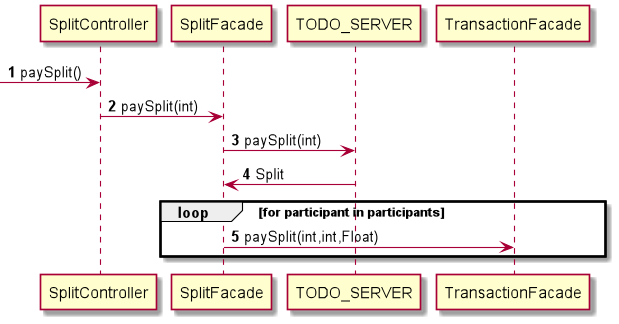

# Use case : make payment

### Class & package diagram

#### There are two scenarios to make a transaction:

##### Scenario 1 : User send money to his friend

The following sequence diagram describes what happens when a user
sends money to a friend

##### Scenario 2 : User pays his share of a split

The following sequence diagram describes what happens when everyone is ready
in a split and when the owner validates the payment.

For every participant of the split, a payment is made to the receiver 
of the split according to the corresponding amount of the participant.

The SplitFacade uses the services provided by the TransactionFacade, 
to whom it delegates these operations

