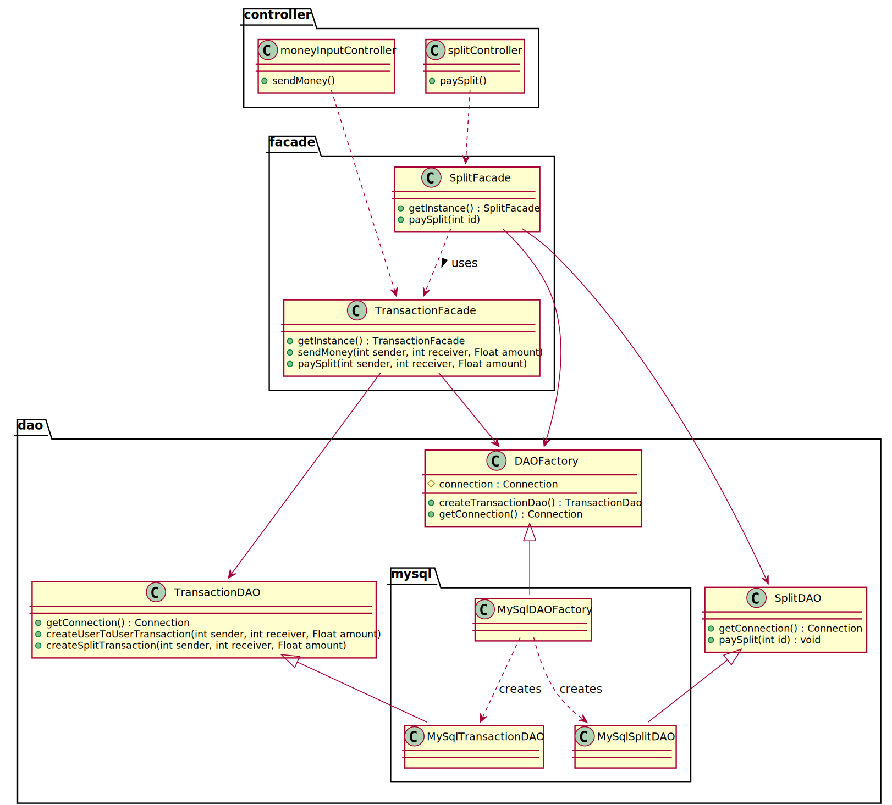
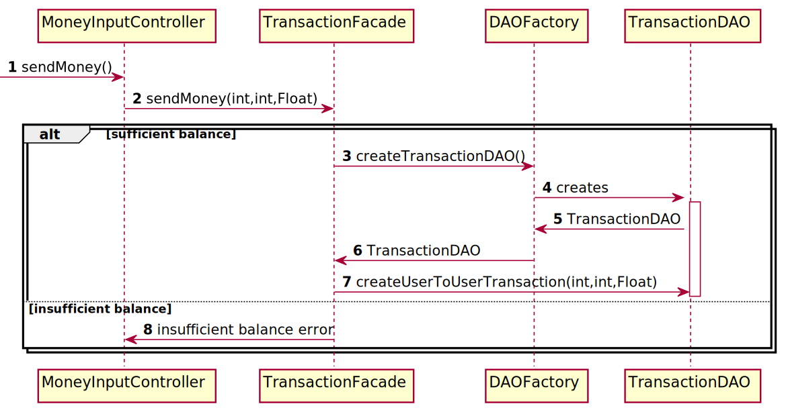

# Use case : make payment

### Class & package diagram

#### There are two scenarios to make a transaction:

#####First scenario : A user sends money to a friend

The following sequence diagram describes what happens when a user
sends money to a friend

Second scenario : A user pays his share of a split