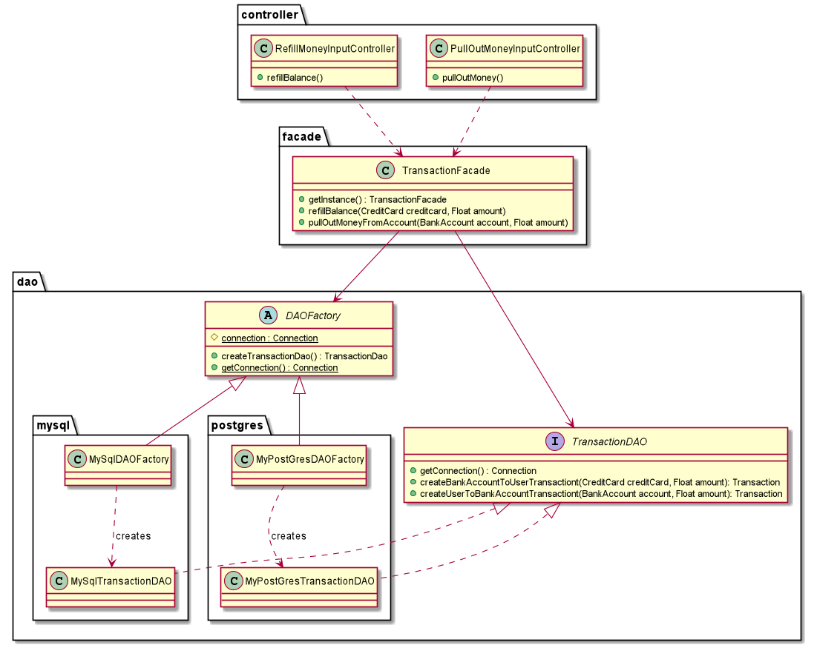
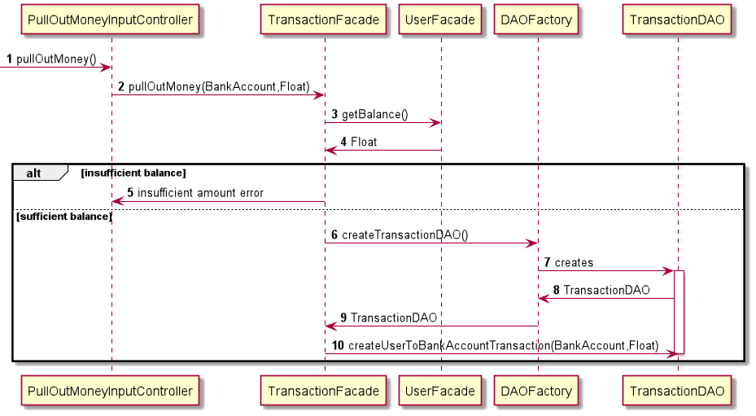
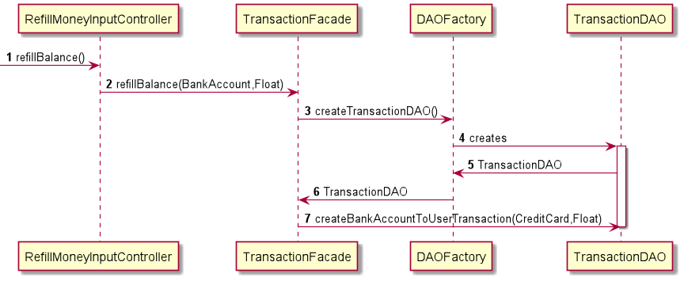

# Use case : manage balance

### Class & package diagram

#### There are two scenarios for a user to manage his balance:

##### Scenario 1 : User pulls out money from his balance to his bank account

##### Scenario 2 : User refill money from a credit card to his account

