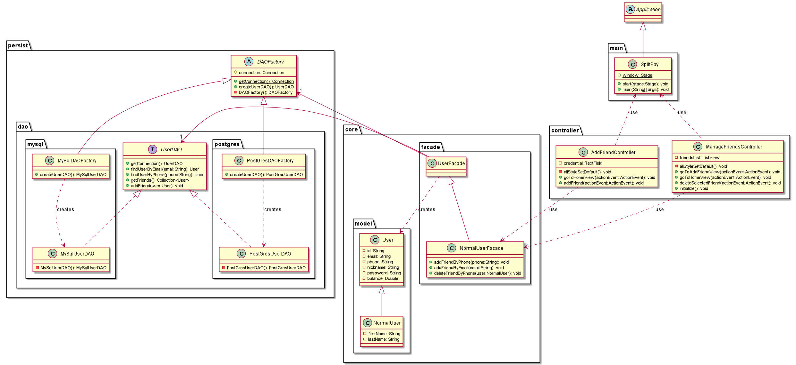
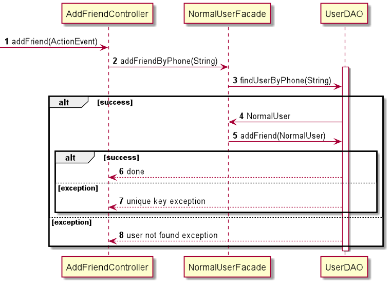

# Use case : manage friends

### Class & package diagram

#### There are two scenarios for friends management:

##### Scenario 1 : Add a friend

The following sequence diagram describes what happens when a user
add a friend

##### Scenario 2 : Delete a friend

The following sequence diagram describes what happens when a user delete a friend.

TODO
