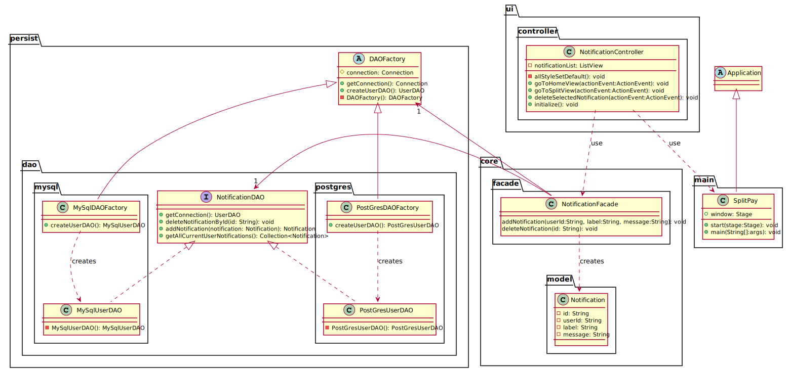
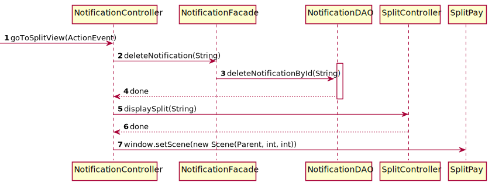

# Use case : manage notifications

### Class & package diagram

#### There are three scenarios for notifications management:

##### Scenario 1 : Click on a Split invitation notification

The following sequence diagram describes what happens when a user
click on a Split invitation notification.

##### Scenario 2 : Delete a notification

The following sequence diagram describes what happens when a user delete a Split invitation notification.

TODO

##### Scenario 3 : Add a notification

The following sequence diagram describes what happens when a controller add a notification to user.

TODO