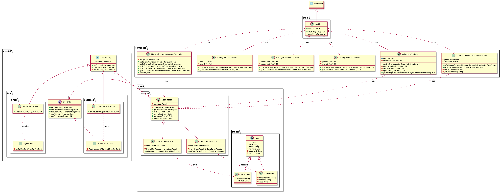
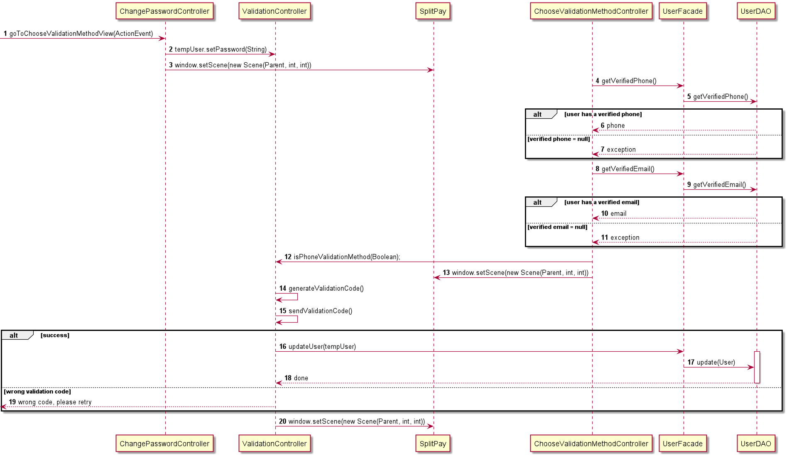

# Use case : manage personnal account

### Class & package diagram

#### There are four scenarios for personnal account management:

##### Scenario 1 : Change password

The following sequence diagram describes what happens when a user
changes his current password

##### Scenario 2 : Change Email

The following sequence diagram describes what happens when a user changes his E-mail adress.

TODO

##### Scenario 3 : Change Phone

The following sequence diagram describes what happens when a user changes his phone number.

TODO

##### Scenario 4 : Delete account

The following sequence diagram describes what happens when a user delete his account.

TODO

