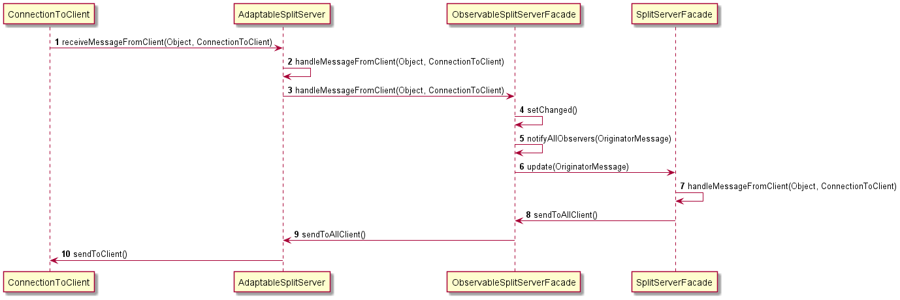
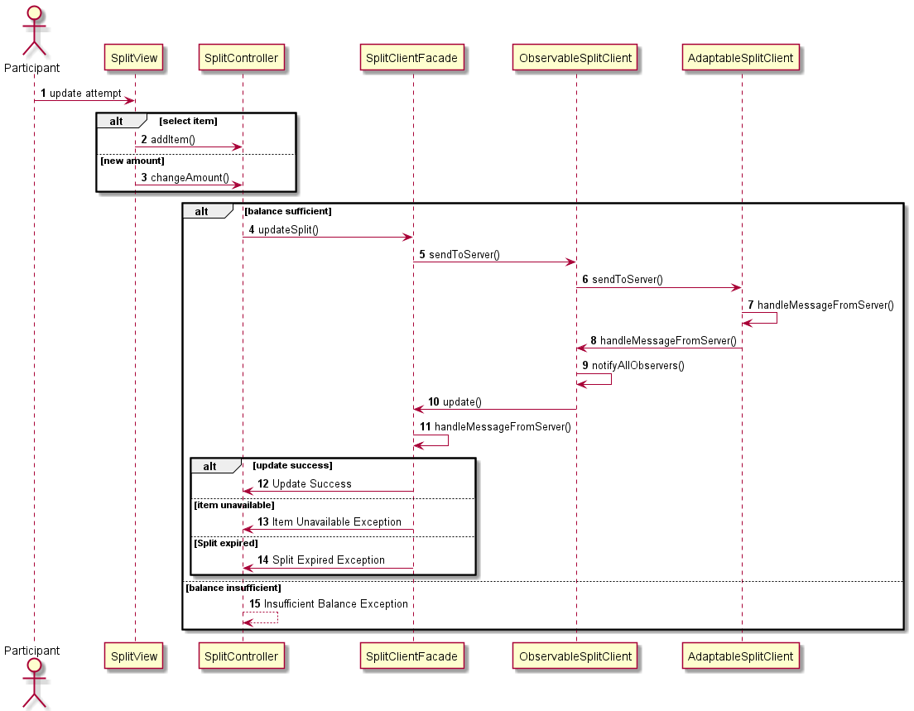

# Use case : manage participant

### Class & package diagram

TODO

#### There are two scenarios for participant management:

##### Scenario 1 : Participant join a split

The following sequence diagram describes what happens when a user
enter in a split on the client side.

The following sequence diagram describes what happens when a user
enter in a split on the server side.

##### Scenario 2 : Participant update a split

The following sequence diagram describes what happens when a user
update a split.

